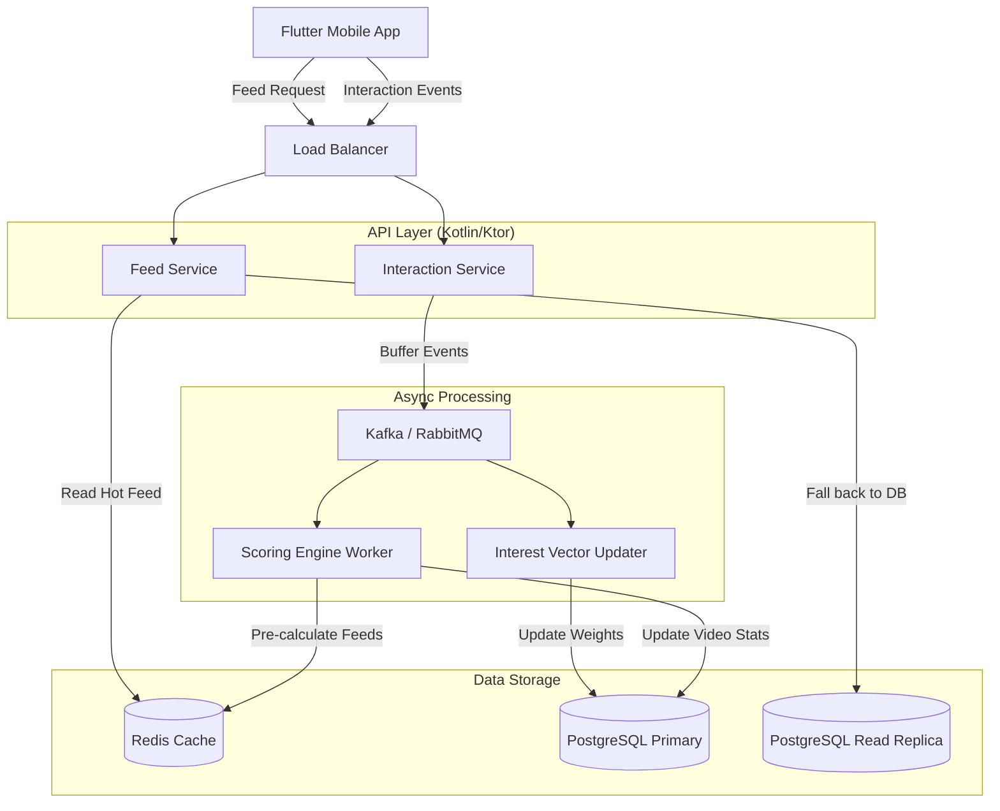

# Scalable Recommendation System Design
## Version 1.0 - Deterministic Weighted Scoring

This document outlines the architecture for the TikTok-scale recommendation engine.

### 1. System Architecture

### 2. Implementation Flow

#### A. Feed Generation (User requests feed)
1. **Client** requests `GET /api/v1/feed?cursor=xyz`.
2. **API** checks **Redis** for a pre-computed feed for this user.
   - *Hit*: Return immediately (< 50ms).
   - *Miss*: Trigger `ScoringEngine` calculation.
3. **ScoringEngine**:
   - Fetches **Candidates** (200 videos: 50% trending + 30% interest-based + 20% random fresh).
   - Fetches **User Profile** (Interest Graph).
   - Runs `score(video, user)` on each candidate.
   - Sorts by score descending.
   - Returns top 20 videos.
   - pushes next 20 to Redis for the next scroll page (Pre-computation).

#### B. Interaction Processing (User watches video)
1. **Client** buffers events (watch time, likes, swipes) locally.
2. **Client** flushes batch every 10s or on app pause to `POST /api/v1/events`.
3. **EventAPI** validates and pushes to **Message Queue** (Kafka/RabbitMQ).
4. **VectorWorker** consumes event:
   - Calculate sentiment (Positive/Negative).
   - Update `user_interest_profile` weights for associated hashtags.
   - *Example*: User skipped "Dance" video -> Decrement "Dance" weight by 0.1.
5. **ScoringWorker** consumes event:
   - Updates global video stats (views, completion rate).
   - If video crosses viral threshold -> add to `Trending` set in Redis.

### 3. API Endpoints

| Method | Endpoint | Description |
| :--- | :--- | :--- |
| **GET** | `/api/v1/feed` | core feed endpoint. Params: `cursor`, `region`. Returns `items[]` |
| **POST** | `/api/v1/events/batch` | Upload user interaction logs. Body: `[{videoId, type, ...}]` |
| **GET** | `/api/v1/user/profile` | Get current user stats and interest graph (debugging). |
| **POST** | `/api/v1/video/{id}/like` | Immediate feedback (Optimistic UI update). |

### 4. Key Algorithms

#### Deterministic Scoring Formula
The score `S` for a video `V` and user `U` is calculated as:

$$ S = (W_c \cdot Completion) + (W_r \cdot Rewatch) + (W_i \cdot InterestMatch) + (W_v \cdot Virality) - (W_p \cdot SkipPenalty) $$

**Where:**
- `Completion` = % of video watched (0.0 to 1.0).
- `Rewatch` = 1.0 if loops > 1, else 0.
- `InterestMatch` = Sum of User Weights for Video Tags.
- `Virality` = Log(Global Views / Time).
- `SkipPenalty` = 1.0 if watched < 1s (Fast Swipe).

**Recommended Weights (Phase 1):**
- `W_c` (Completion): 50 pts
- `W_r` (Rewatch): 20 pts
- `W_i` (Interest): 30 pts
- `W_v` (Virality): 10 pts
- `W_p` (Penalty): 15 pts

### 5. Deployment Strategy
- **Kotlin Backend**: Deploy as containerized service (Docker) on Kubernetes.
- **Database**: Managed PostgreSQL (AWS RDS or equivalent).
- **Cache**: Redis Cluster for high availability.
- **Scaling**: Auto-scale API pods based on CPU/Request count. Database read replicas for Feed generation.
